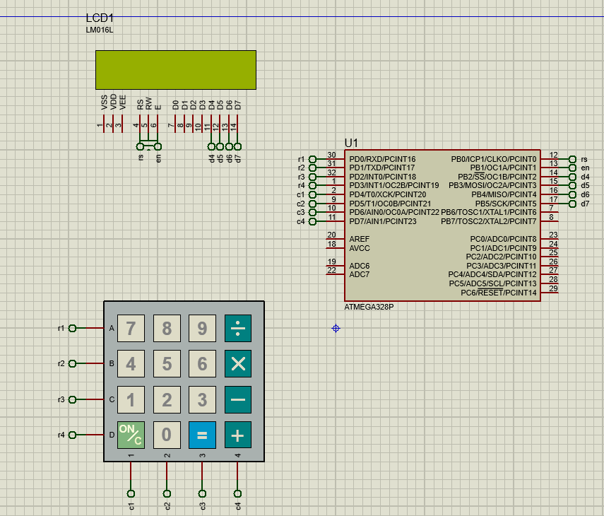

# Arduino Calculator with Atmega328p Proteus Simulation 

This repository presents an Arduino project that implements a simple calculator using a 4x4 keypad and an LCD display. Additionally, a `Atmega328p` Proteus simulation is included to visualize the circuit and test the functionality without the need for physical components.



## Video in which I explained the code


## Hardware Setup
- Connect the rows (r1-r4) to pins 0-3 on the Arduino.
- Connect the columns (c1-c4) to pins 4-7 on the Arduino.
- Connect the LCD display to pins 8-13 on the Arduino.

## Keypad Layout
The keypad layout is as follows:
```
7 8 9 /
4 5 6 *
1 2 3 -
C 0 = +
```

## Usage
1. Enter the first number using the keypad.
2. Press an operator (+, -, *, /).
3. Enter the second number.
4. Press '=' to see the result on the LCD display.
5. Press 'C' to clear the calculator and start over.

## Repository Structure
- **`Calculator.ino`**: Arduino code for simple Calculator implementation.
- **`Calculator.pdsprj`**: Proteus simulation file for visualizing the implementation.
- **`Calculator.ino.with_bootloader.hex`**: The hex file from the arduino compile.

Feel free to explore, modify, and use this code and simulation for your own Arduino and Proteus projects!